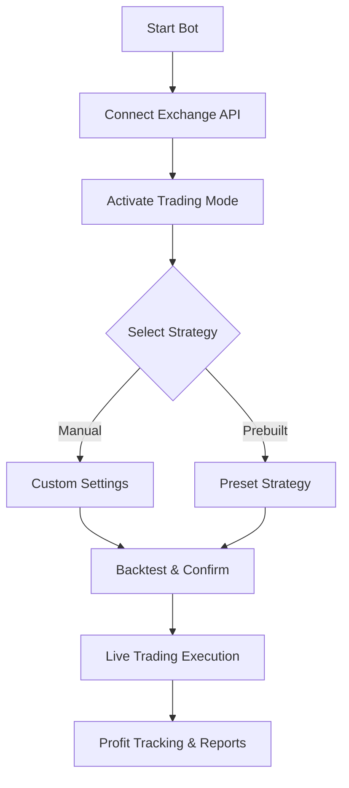

# PumpFun Trading Bot – Full Features & Secure Activation Guide

The world of cryptocurrency trading evolves quickly, and tools like **PumpFun Trading Bot** are gaining attention for their ability to automate strategies, reduce risks, and maximize profits. If you're exploring how to activate and use this bot effectively, this guide walks you through the essential features, benefits, and activation methods for **free access** and **full functionality**.

---

## Overview of PumpFun Trading Bot

The **PumpFun Trading Bot** is designed for traders who want to participate in fast-paced markets where timing is everything. Whether you’re targeting meme coins, small-cap tokens, or larger digital assets, the bot provides instant execution, customizable strategies, and strong security protocols.

By unlocking the bot through **activation tools**, traders gain full access to premium settings, backtesting options, and integrations that make market participation smoother and more professional.

> \[!IMPORTANT]
> Always use official or trusted activation methods to ensure **safe trading** and avoid third-party risks.

---

## Key Benefits 🎯

* **Automated Execution:** Enter and exit trades at lightning speed without manual effort.
* **Free Access Options:** Trial versions and activation utilities provide entry points before committing fully.
* **Advanced Security:** Encrypted API handling and multi-layer protections ensure your funds remain safe.
* **Community Participation:** Join groups where strategies, signals, and settings are openly shared.
* **Scalability:** Suitable for both small retail traders and larger portfolios.

---

## Core Features

Here’s what makes PumpFun Trading Bot stand out:

* **One-Click Activation** → Easy setup and quick start for beginners.
* **Custom Strategy Builder** → Create trading rules using technical indicators.
* **Live Market Scanning** → Instantly identify coins with sudden price movements.
* **Anti-Rug & Safety Checks** → Filters risky tokens before executing trades.
* **Backtesting & Analytics** → Simulate strategies against historical data.
* **Integration with Exchanges** → Works seamlessly with popular trading platforms via APIs.

---

## How PumpFun Trading Bot Works

The workflow of PumpFun is streamlined for both novice and advanced users.

---

## Activation & Free Access

Getting full access to PumpFun Trading Bot involves **activation utilities** or trial licenses.

* **Free Trial Access:** Limited features but great for testing the environment.
* **Activation Utilities (Keygen/Unlock Tools):** Unlock the full professional version without restrictions.
* **Premium Plans:** Direct purchase options for guaranteed official support.

> \[!NOTE]
> Activation doesn’t just unlock the bot – it enables **unlimited use, advanced automation, and professional features** for serious traders.

---

## Benefits of Full Activation 💎

When you activate the full version of PumpFun Trading Bot, you gain:

* Unlimited trading pairs
* Advanced risk management tools
* Access to private strategy templates
* Priority community support
* Faster update rollout
* Professional-grade analytics

| Access Type        | Features Unlocked | Best For              |
| ------------------ | ----------------- | --------------------- |
| Free Trial         | Basic trading     | Beginners testing use |
| Activated Full Bot | Unlimited tools   | Active day traders    |
| Premium Membership | All + Support     | Professional traders  |

*Table accessibility note: Users with screen readers can navigate this table to compare free vs activated vs premium options.*

---

## Security & Trust

Since PumpFun Trading Bot requires **API key connections** with exchanges, security is critical.

* API keys are encrypted and never shared.
* No withdrawal permissions required.
* Secure cloud-based or local running options.
* Frequent updates ensure compliance with market changes.

> \[!IMPORTANT]
> Always run the bot from **trusted sources** and double-check API settings to protect your assets.

---

## Community Growth & Participation

One of PumpFun’s biggest strengths is its active community. Users share strategies, preset configurations, and trading insights, making the experience collaborative. Participation also improves learning speed for new traders.

Badges and recognition systems encourage healthy competition and growth within the trading ecosystem.

---

## FAQ – PumpFun Trading Bot

**Q1: Is PumpFun Trading Bot free to use?**
Yes, there is a **free trial version** with limited features. Full features require activation or a premium plan.

**Q2: Do I need coding skills to use it?**
No, it comes with a **user-friendly dashboard** and preset strategies for quick setup.

**Q3: Is it safe to connect my exchange account?**
Yes, as long as you **use read/trade-only API keys** and disable withdrawals.

**Q4: What exchanges are supported?**
It integrates with most major exchanges that allow API trading.

**Q5: What happens after activation?**
You gain **full professional access**: unlimited trades, advanced analytics, and priority support.

---

## Get Started with PumpFun Trading Bot

To experience **professional trading automation with free access and secure activation**, try PumpFun Trading Bot today.

---

